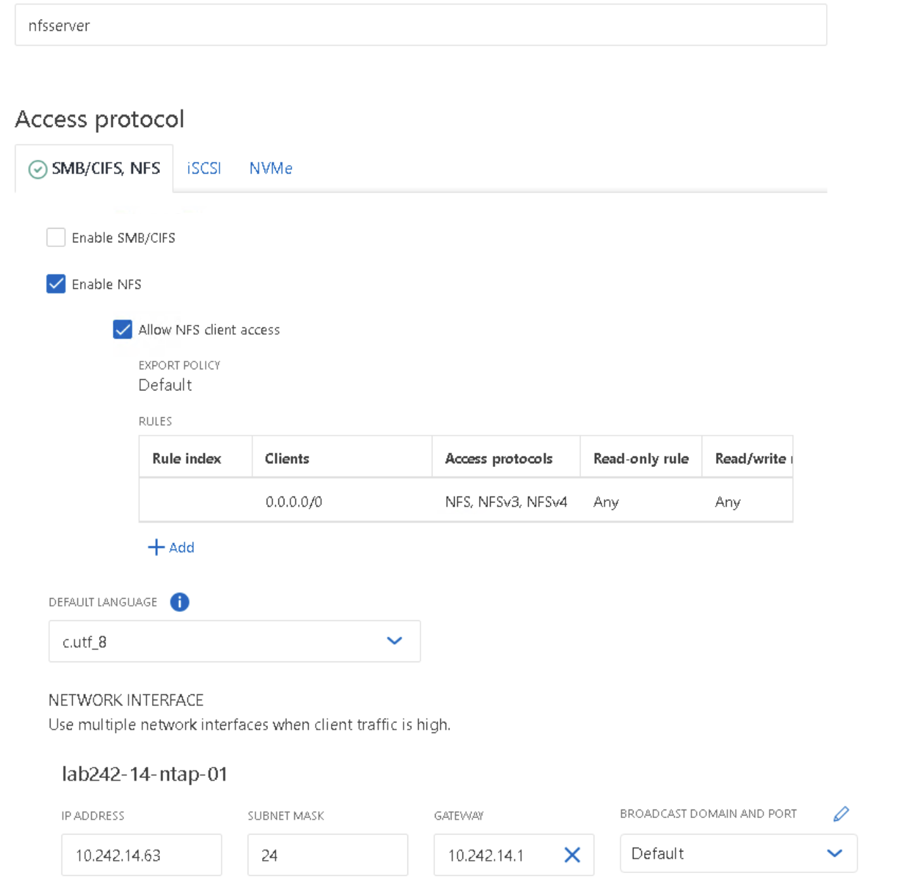
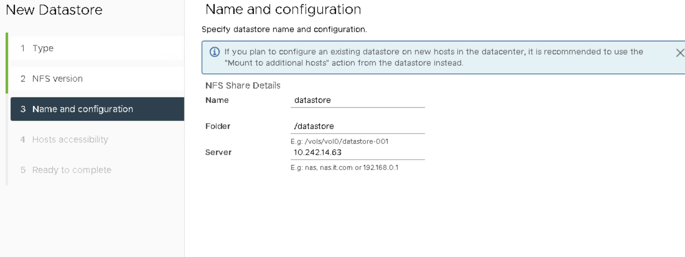

# NetApp OnTap Basics

In this lab you will setup a new NetApp Cluster and perform routine storage administrative duties. While the core cluster is already in place, your responsibilities include generating new storage virtual machines, volumes, and shares. This lab caters to individuals without prior NetApp experience, utilizing the System Manager web interface for task execution

## Lab Activities

* Part 1: Schedule and Access Your Lab
* Part 2: Initial Setup Activities
* Part 3: SMB Storage Provisioning
* Part 4: NFS Storage Provisioning
* Part 5: Routine Storage Administrative Tasks

## Part 1: Schedule and Access Your Lab

1. Navigate to <https://catalog.siriussdx.com/login.php?sso&redirect=/catalog.php?category_id=19>

2. You will need to login to schedule the lab.  If you don't have an account you can create one by selecting the `Sign up` link at the bottom of the login box.

3. Access the lab by following the instructions that were emailed to you.

## Part 2: Initial Setup Activities

1. On the lab jumpbox, launch the NTAP shortcut.  This shortcut will take you to the NetApp System Manager web interface.

2. You will get a "Your connection is not private" message, select advanced and then click Proceed.

3. Input your credentials and click Sign In.
    * Username - admin
    * Password - SDNlab01@

4. Upon successful login you will be directed to the System Manager Dashboard.  The Dashboard provides a overview of the cluster's overall health and configuration.  You will notice the controller model, in this case it's virtual, capacity, system performance and network details.  Currently these panels don't contain any information as we haven't started the setup process.

5. One of the first tasks we will perform is Preparing Storage.  When we prepare the storage it is going to create aggregates/local tiers.  We will store virtual machine and user data in the local tiers.
      * A) Select Prepare Storage from the dashboard.
      * B) Within the Prepare Storage screen it will ask if you want to enable software encryption.  For the purposes of this lab we will not enable encryption.  Select Continue without a key manager and select Prepare storage.  This process could take a few minutes.

      * C) You will be redirected to the dashboard and you should be able to see available capacity in the capacity panel.

## Part 3: SMB Storage Provisioning

1. We will create our first storage virtual machine/SVM.  The SVM is a logical storage container that runs within the cluster.  Each SVM has it's own set of network interfaces, volumes, LUNS and protocols.  By creating logical storage containers you are able to segment protocols, departments and active directory domains.
      * A) From the Dashboard select Storage, and then select Storage VMs.
      * B) From the Storage VMs screen we will select Add.

      * C) A new panel will open with the title of Add storage VM.  We will give the Storage VM a name and configure protocols.
            *Storage VM Name - fileserver
            * Access protocol - Enable SMB/CIFS
      * D) Once you select Enable SMB/CIFS a sub dialog box will open.  You will need to input your Active Directory information.  This SVM will be joined to the domain with a computer object.
        * Administrator Name - Administrator
        * Password - SDNlab01@
        * Server Name - fileserver
        * Active Directory Domain - This will be the domain your lab is configured with.  You can get this information by opening a command prompt and typing ipconfig /all.  The DNS Suffix Search List is the Active Directory Domain you will input.

            * We will leave the Organizational Unit defaulted to CN=Computers
            * Domains - This will be the same Active Directory Domain name you gathered before
            * Name Servers - You can get this IP address from the ipconfig /all output from before.  Copy of the value of DNS Servers.
            * IP address - You will use the first 3 octets of the DNS server.  The last octect will be .62.
            * Subnet Mask - Should auto populate, if not click off the IP address field.
            * Gateway - Should auto populate, if not click off the IP address field.
            * Broadcast Domain and Port - Default

      * E) Verify all of the data is correct and select Save.  If everything was put in correctly the new fileserver will be created and it will take you back to the Storage VMs page.  At this point you've created a new SVM and joined it to the domain. This new SVM has been configured to serve the SMB/CIFS protocol.

2. Create a new volume and network share that users can access and write files to.
      * A) Within System Manager select Storage and then Volumes
      * B) Select the Add button to create a new volume with the following details
        * Name - it_dept
        * Size - 10 GiB
        * Share via SMB/CIFS - Make sure this box is selected
        * Select the Save button

        * Once the volume is created it you will be back at the volumes screen with the new it_dept volume.
      * C) Review the share that was automatically created for you by selecting Storage and then Shares from the System Manager interface.  Notice how it created a it_dept share for you? Click on the share and exam the details.

      * D) Map a network drive to the share we created and write a file to it.
        * Select the windows folder icon on the taskbar.
        * On the top of the windows explorer window, select computer and then map network drive and select map network drive.
        * In the Map Network Drive put in the following values.
            * Drive - Z:
            * Folder - \\\fileserver\it_dept
            * Leave Reconnect at sign-in selected
            * Select Finish

            * A new windows explorer window will open and you should see the it_dept share we created.
            * Right click anywhere in blank area of the share and create a new text document.  Input some random text and verify that you an save it.
            * Go back to windows explorer, click on This PC on the left hand side.  Review the size of the drive we mapped.

## Part 4: NFS Storage Provisioning

1. We will create our second storage virtual machine/SVM and configure it with NFS.  We will create a volume on the SVM and present it as a datastore to VMware.
      * A) From the Dashboard select Storage, and then select Storage VMs.
      * B) From the Storage VMs screen we will select Add.
      * C) A new panel will open with the title of Add storage VM.  We will give the Storage VM a name and configure protocols.
        * Storage VM Name - nfsserver
        * Access protocol - Enable NFS
        * Allow NFS client access - make sure this box is checked
        * Export Policy Default - Under rules select Add
        * A New Rule window will open
        * Under Client Specification input  - 0.0.0.0/0
        * Access Protocols - Deselect SMB/CIFS and FlexCache, leave NFS selected
        * Access Details - Select all for Read-only access, Read/write access and Superuser access and select save

        * Default Language - Leave to the default of c.utf_8
        * IP Address - You will use the first 3 octets of the DNS server.  The last octect will be .63
        * Subnet Mask - Should auto populate, if not click off the IP address field
        * Gateway - Should auto populate, if not click off the IP address field.
        * Broadcast Domain and Port - Default
      * E) Verify all of the data is correct and select Save.  If everything was put in correctly the new nfs server will be created and it will take you back to the Storage VMs page.  At this point you've created a new SVM with the NFS protocol.

2. Now you will create a new volume and network share that we will mount to VMware as an NFS datastore.
      * A) Within System Manager select Storage and then Volumes
      * B) Select the Add button to create a new volume with the following details
        * Name - datastore
        * Size - 100 GiB
        * Storage VM - nfsserver
        * Export via NFS - Make sure this box is selected
        * Select the Save button

      * C) Go back to the desktop on your jumpbox.  You will see a shortcut to vCenter.
        * You will get a "Your connection is not private" message, select advanced and then click Proceed.
            * Select Launch Vsphere Client (HTML5)
            * Username - <administrator@vsphere.local>
            * Password - SDNlab01@
            * Select the Login button
 
            * On the left hand side expand vcenter, expand DC and then expand CL.
            * Right click on the cluster name of CL, select Storage and then select New Datastore.
 
            * In the New Datastore window we will select a type of NFS and select next.
 
            * NFS Version - NFS 3, select Next
            * Name - datastore
            * Folder - /datastore, remember the case is sensitive here.
            * Server - X.X.X.63, You will use the first 3 octets of the DNS server select next
 
            * Select both ESX hosts and select next.
 
            * Validate the data you put in and select Finish.
            * You should now see a datastore called datastore in your vCenter browser.  You can confirm this by clicking on the datastore icon in the top left.  Expand the DC datacenter and verify datastore shows below.
 
            * This datastore would now be ready for productive use.  You could create virtual machines, folders and ISO's in this datastore.  We won't be creating any virtual machines in this lab.

## Part 5: Routine Storage Administrative Tasks

1. In this lab we will walk through some routine storage administrative tasks.  These are common tasks you can expect to perform while administering a NetApp Storage System.
      * A) One request that will come in is to increase space on a shared network drive.  In lab 2 we created a volume called it_dept and gave it 10GiB of capacity.  Let's walk through increasing the capacity on this volume/share.
        * Open the NetApp System Manager web interface, you might have to log back in.
        * Select Storage and then volumes.
        * Hover over the it_dept volume and click the 3 dots to the far right.

        * Select the Resize option.
        * Change the Capacity to 20GiB and select Save.  Notice how it's reserving 5% of space for snapshots?  
        * Confirm the Capacity has changed within the system manager interface.
        * Let's confirm that the shared network drive is also showing the correct space.
        * Open your windows file explorer and select This PC from the left hand menu.
        * Verify that share it_dept under network locations is showing the correct size.
 
      * B) Another request that will come in is to restore a file from a snapshot.  Let's go back out to our network share and restore a file from a NetApp snapshot.
        * Open the NetApp System Manager web interface.
        * Select Storage and then volumes.
        * Select the it_dept volume.  You will notice it brings up another tile in the left hand side.
        * Select the Snapshot copies tab and review the contents.
        * Click on Add in the snapshot copies tab.
        * Under Snapshot Copy Name give it a name of test and select Add.

        * Verify you see the new snapshot copy name of test.
        * Now we are going to open windows file explorer.
        * Click on This PC
        * Double click the it_dept share we mapped earlier.  
        * Right click the test.txt document we created earlier and delete it. On the delete file confirmation screen choose yes.
 
        * Let's restore the file we just deleted from a snapshot.  Right click on any open space in the it_dept network drive.
        * Select Properties and then go to the previous versions tab.  Notice the snapshots listed in here?
        * Let's select the latest snapshot, which should be the first one listed.  
        * Towards the bottom of the screen you will select open.  A new window will open up showing the text.txt file we previously deleted.
        * Drage the text.txt file from the restore directory back to the it_dept directory.
 
        * Verify you can open the file from the it_dept directory and make changes to it.
      * C) Another request that will come in is to create a new share.  For this purpose we are going to create a new share from the existing it_dept volume we created earlier.  
        * Open windows file explorer.
        * Click on This PC  
        * Double click the it_dept share we mapped earlier.  
        * Right click anywhere in the open space and choose New and then Folder
        * Give the folder a name of new_share  
 
        * Open the NetApp System Manager web interface.
        * Select Storage and then shares.
        * Select Add and then select Share
        * Share Name - New_Share
        * Under the folder name click Browse
        * Double click the it_dept folder and then select new_share, select Save
        * Under Access Permission select +Add, leave the default of Everyone Full Control
        * Select the Save button
 
        * Verify you can see the new share by opening windows file explorer.
        * In the path put in \\\fileserver, verify that New_Share is visable.
 
        * Double click the New_Share and verify you can write a new text document in it.
      * D) Now we are going to focus on the NFS datastore we provisioned for VMware.  In lab 3 we created a datastore for VMware that's 100Gib in size.  We have a VMware administrator asking us to increase the capacity on that datastore.
        * Open the VMware vCenter web interface, you might have to log back in.
        * Select the datastore icon at top left of the screen, expand DC and select datastore.
        * Verify that the current capacity shows as 100GiB.

        * Open the NetApp System Manager web interface, you might have to log back in.
        * Select Storage and then volumes.
        * Hover over the datastore volume and click the 3 dots to the far right.
 
        * Select the Resize option.
        * Change the Capacity to 200GiB and select Save.  Notice how it's reserving 5% of space for snapshots?  
        * Confirm the Capacity has changed within the system manager interface.
        * Let's confirm that the VMware datastore is seeing the new capacity.
        * Open the VMware vCenter web interface.
        * Select the datastore icon at top left of the screen, expand DC and select datastore.
        * On the far righthand side of the screen click on Refresh under capacity.
        * Verify that the datastore capacity now shows as 190Gib.
 
